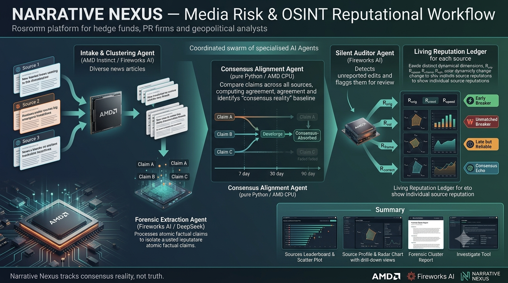

# Narrative Nexus

**A media-behavior measurement instrument.** Narrative Nexus monitors 37 news outlets across 6 continents and algorithmically measures their *reporting behavior* over time — not to judge who is "right," but to answer: which sources reliably break stories ahead of the mainstream consensus, which generate systematic noise, and which quietly rewrite their articles after publication?

Built for the AMD Developer Hackathon ACT II (Track 3 — Unicorn) by **DreamTeam**.

> *"Narrative Nexus tracks consensus reality, not truth."*



**Submission materials:**
- 📊 Slide deck: [`narrative-nexus-deck.pdf`](narrative-nexus-deck.pdf)
- 🎥 Demo video: [`demo-video-01.mp4`](demo-video-01.mp4)

---

## What it does

Four AI agents run in sequence over live news:

1. **Intake & Clustering** — embeds articles from 37 outlets, groups them into story clusters by semantic similarity (DBSCAN over BGE embeddings, 14-day windows).
2. **Forensic Extraction** — strips editorial framing and extracts atomic factual claims as structured JSON via LLM.
3. **Consensus Alignment** — pure math: finds where ≥2 independent consensus-pool sources converge on the same claim. That convergence is "consensus reality."
4. **Silent Auditor** — re-reads old articles and flags significant unannounced edits.

The output is a **living reputation ledger**: six behavioral dimensions per source per topic vertical, no composite score. The Sources scatter plot splits the panel into four behavioral archetypes — **Early Breakers, Unmatched Breakers, Late but Reliable, and Consensus Echoes** — visible at a glance.

## AMD Platform Usage

**All AI pipeline stages are configured to run on Fireworks AI, which serves inference on AMD Instinct accelerators.**

| Pipeline Stage | Default Provider | Evidence |
|----------------|-----------------|----------|
| Agent 1 — Embeddings & Clustering | Fireworks AI | `config/providers.json` (`"agent1_embedding": "fireworks"`) |
| Agent 1 — LLM Classification | Fireworks AI | `config/providers.json` (`"agent1_llm": "fireworks"`) |
| Agent 2 — Forensic Claim Extraction | Fireworks AI | `config/providers.json` (`"agent2_llm": "fireworks"`) |
| Agent 4 — Silent Auditor | Fireworks AI | `config/providers.json` (`"agent4_llm": "fireworks"`) |
| Claim Matching (cross-stage) | Fireworks AI (nomic-embed) | `config/providers.json` (`"claim_matching_embedding": "fireworks-nomic"`) |

Fireworks AI serves inference on AMD Instinct MI300X and MI250X accelerators. Every LLM inference and embedding call through the Fireworks provider routes through AMD Instinct hardware. The shipped database was constructed by running these agents — clustering, claim extraction, claim matching, and consensus — through Fireworks during hackathon week (July 3–5, 2026), using the hackathon-provided Fireworks credits.

### Gemma integration

**Gemma 4 E4B** (deployed on-demand via Fireworks AI) was verified against
Agent 2's claim-extraction prompt across the full 61-article Venezuela cluster
(268 structured claims); documented in `docs/evidence/gemma/`. It is not
wired into the shipped provider configuration. In verified test runs, Gemma
executed Narrative Nexus's Agent 2 claim-extraction prompt across the
full 61-article Venezuela story cluster, returning 268 structured claims
(36 of 61 articles parsed cleanly — per-article results and token usage
in [`docs/evidence/gemma/batch_results.json`](docs/evidence/gemma/batch_results.json)).
Full evidence — model string, smoke test, extraction output, and batch
summary — is in
[`docs/evidence/gemma/README.md`](docs/evidence/gemma/README.md).
Gemma is an optional provider; the shipped database was built with the
default Fireworks/DeepSeek configuration.

**Provider configurability:** runtime provider selection is visible on the Pipeline page (`/pipeline`), where each agent stage shows a dropdown of available compute providers. Fireworks entries carry an `(AMD)` badge. The architecture is deliberately provider-agnostic — Fireworks/AMD is the default, not a hard dependency.

**Honest wording note:** we say "configured to run" because individual LLM responses carry no hardware attestation trail. The system routes AI workloads through Fireworks AI on AMD Instinct via `config/providers.json` defaults and the Pipeline page dropdowns.

---

## Running Narrative Nexus

### Recommended: one-command Docker run

The app ships as a single self-contained container — FastAPI backend, the pre-built demo database, and the compiled SPA frontend, all in one image. From a fresh clone:

```bash
git clone https://github.com/afshinator/narrative-nexus
cd narrative-nexus
docker compose up --build
```

> **Always use `--build`.** `docker compose up` alone reuses any existing
> `narrative-nexus_app` image from a prior run and will serve stale code even
> after you pull new changes; `--build` forces a fresh image from current source.

Then open **http://localhost:8000**.

`docker compose up` builds the image on first run (from `Dockerfile.app`, per `docker-compose.yml`) and starts it — no separate build step. **No API keys are required** to browse the dashboard: the demo database (`data/demo/demo.db`) is baked into the image.

The shipped database contains 358 articles from 37 sources, 378 extracted claims, 17 story clusters, and a 123-day reputation snapshot series — all produced by the real pipeline. Nothing is mocked.

> **Rebuilding after changes:** `docker compose up --build` forces a fresh image build.

### Optional: API keys for live collection

Keys are needed **only** for live scraper collection or new pipeline runs — not for browsing the shipped data. Copy the template and fill in what you have:

```bash
cp .env.example .env
# then edit .env — FIREWORKS_API_KEY, FIRECRAWL_API_KEY, DEEPSEEK_API_KEY, OPENAI_API_KEY
```

Compose picks up `.env` automatically on the next `docker compose up`.

### To collect live data

Open **Settings** and press **Start** on the scraper. It polls RSS feeds from all 37 sources and runs new articles through the pipeline. Each clone is its own instance with its own database — collect as much or as little as you want.

> On shared or hosted instances, set `NN_DISABLE_SCRAPER=1` to prevent visitors from starting live collection against a shared database (see [Hosted deployment](#hosted-deployment) below).

### Alternative: host-based developer setup

If you prefer to run the backend and frontend directly on the host (for development, without Docker):

```bash
# 1. Install dependencies
npm install
pip install -r requirements.txt

# 2. (Optional) API keys — only for live collection / pipeline runs
cp .env.example .env   # then edit

# 3. Build the frontend
npm run build

# 4. Run the backend (serves the API and the built SPA on :8000)
python3 -m uvicorn app.main:app --host 0.0.0.0 --port 8000
```

Then open **http://localhost:8000** — same as the Docker path.

---

## Where to look first

- **Sources** (`/`) — the reputation scatter. Every dot is an outlet, positioned by how often it breaks claims early (x) vs. how often those claims survive into consensus (y). Four labeled corners. Click any dot for that outlet's six-dimension profile.
- **Stories** (`/stories`) — two fully-traced story clusters:
  - *US-Iran War: March Escalation & April Ceasefire* — a 48-day arc from a single outlet's scoop to cross-source consensus, animated on its Timeline.
  - *Venezuela Emergency and Rescue Response* — a 5-day surge: 20 outlets, 138 claims, and the system separating corroborated facts from single-outlet outliers in real time.
- **Pipeline** (`/pipeline`) — the four-agent machine, live provider assignments, AMD badges.
- **Panel** (`/panel`) — the 37-source panel across 5 tiers and 7 regions; toggle sources on/off and watch the Sources page respond.

## Stack

| Layer | Tools |
|-------|-------|
| Frontend | React 19, TypeScript, Vite, Tailwind 4, shadcn |
| Routing / State | react-router, zustand |
| Visualizations | D3 (scatter, timeline, pipeline), Chart.js (radar) |
| Backend | FastAPI, SQLite (WAL), APScheduler |
| AI | Provider-agnostic LLM + embedding clients. Default: Fireworks AI (AMD Instinct). Alternatives: DeepSeek, OpenAI, local CPU via sentence-transformers |

## The analytical model, briefly

- A claim becomes **consensus-absorbed** only when ≥2 independent consensus-pool sources report it AND it crosses a per-vertical threshold (65–75%). Single-source claims can never self-validate.
- Sources are scored on six independent dimensions (origination rate, validation rate, speed, framing consistency, silent-edit rate, correction rate) — never collapsed into one ranking.
- The panel spans 5 tiers deliberately: wire services anchor the consensus baseline, while regional and contrarian outlets are tracked *against* it — that contrast is where the interesting signal lives.

Full model documentation: `docs/design-v1.3.md`. Data provenance and per-source stats: `docs/faq-pipeline-data.md`, `docs/faq-source-selection.md`.

## Hosted deployment

Set `NN_DISABLE_SCRAPER=1` to disable the scraper on shared or hosted instances. This prevents any visitor from accidentally starting live collection and mutating the shared database. When set:

- `POST /api/scraper/start` returns **403 Forbidden** with `"Scraper is disabled on this deployment."`
- `GET /api/scraper/status` includes `"disabled": true`
- The Settings page shows amber text: *Scraper disabled on this deployment.* — with the Start button disabled.

Unset (the default) leaves the scraper fully functional for local or single-user deployments.

**Intended target:** Hugging Face Spaces (Docker SDK Space, `app_port: 8000`, set `NN_DISABLE_SCRAPER=1` as a Space variable). See `docs/deployment-todo.md` for the deferred hosting checklist.

---

*"Narrative Nexus tracks consensus reality, not truth."*
README.md
Displaying README.md.